# ☁️ CONFIGURANDO RECURSOS E DIMENSIONAMENTOS DE MÁQUINAS VIRTUAIS NO AZURE  
 

  

---  
## ⏯️ INTRODUÇÃO  

Neste laboratório do bootcamp <i>Azure Essencials</i>, foram abordadas questões referentes a formas de configuração de recursos e dimensionamentos de máquinas virtuais no portal <a href='https://portal.azure.com/'><i>Microsoft Azure</i></a>. Através do projeto, foram explorados conceitos sobre redes virtuais, balanceamento de carga. 
     

   

--- 
## 🗒️RESUMO DOS TÓPICOS:  

- Ao criar uma máquina virutal no Azure, serão incluidas automaticamente algumas configurações pré-definidas, como indica o aviso sobre a série F em destaque na imagem acima. Ao selecionar a região, recomenda-se escolher regiões com custo menor, como <i>(US) East US 2</i>. A escolha da Zona de Disponibilidade tem como consequência a escolha de um datacenter específico.
     

   

- É importante saber configurar o conjunto de dimensionamento de máquinas virtuais, com quantas máquinas vai começar, em quantas se farão alterações, o que vai mudar nelas e até quanto alguma vai crescer.
    

  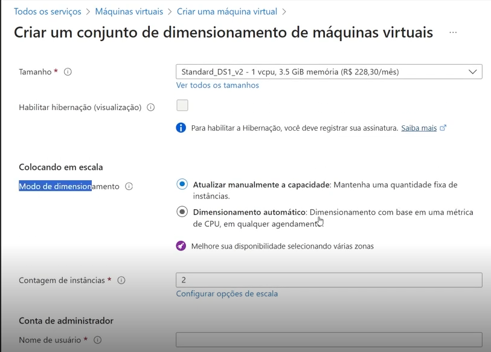
  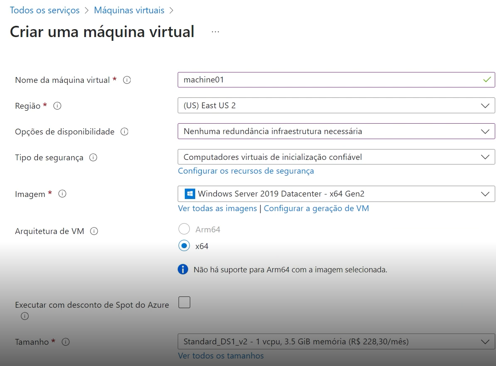

- Na configuração de escalas, o modo de dimensionamento pode ser por atualização manual da capacidade ou por dimensaionamento automático (usando métrica de CPU), e é mais prudente por haver uma contagem de dimensionamento. Geralmente, configura-se crescimento e resução de escala na mesma quantidade, mas não é uma regra.
    

  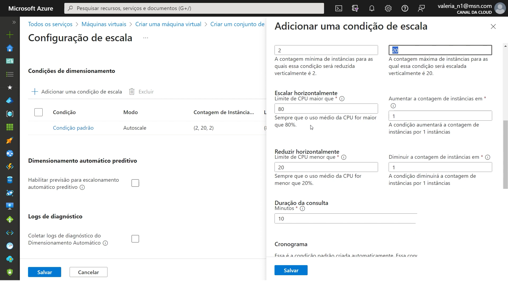 

- <i>Azure Spot</i>i> oferece a capacidade não usada do Azure por taxa com desconto, mas deve ser liberada se surgir usuário que pague o valor cheio. Neste caso, a VM do pagante com desconto é derrubada. Apesar da imprevisibilidade de uso, torna-se interessante, pelo menos, para tarefa de desenvolvimento e testes, nunca para produção porque pode gerar problemas graves.
    

  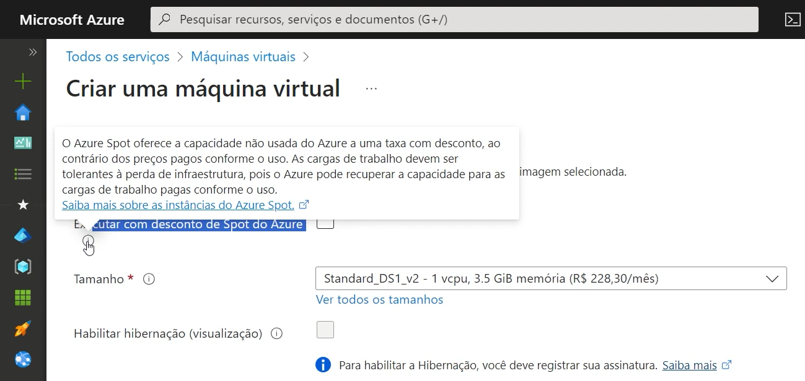  

  

- Ao selecionar o tamanho da VM, é oferecido um link para consultar uma tabela de: famílias de máquinas com tamanhos mais usados e séries relacionadas a um modelo de trabalho com carga específica. Primeiro selecona-se a família, depois o modelo compatível.
     

  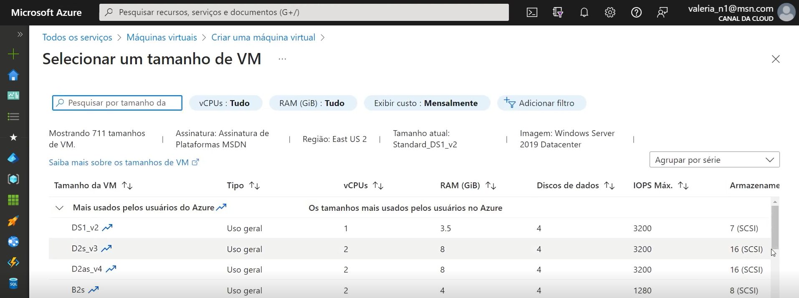
  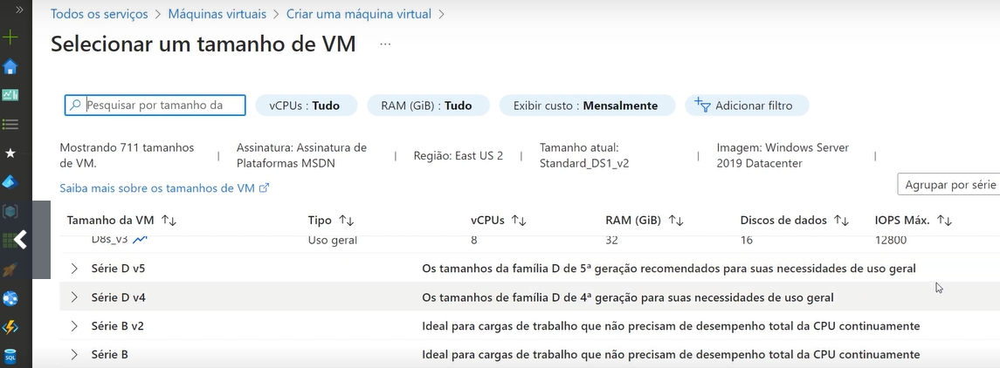

- Geralmente, bancos utilizam opção de disco de VM pré-preparado com imagem que faça sentido para a empresa, por terem aplicações específicas e questões de segurança. O disco é salvo e reaproveitado para outras VMs. Entre as opções de portas de entrada da VM, há a RDP 3389 com conexão para área de trabalho remota.
    

  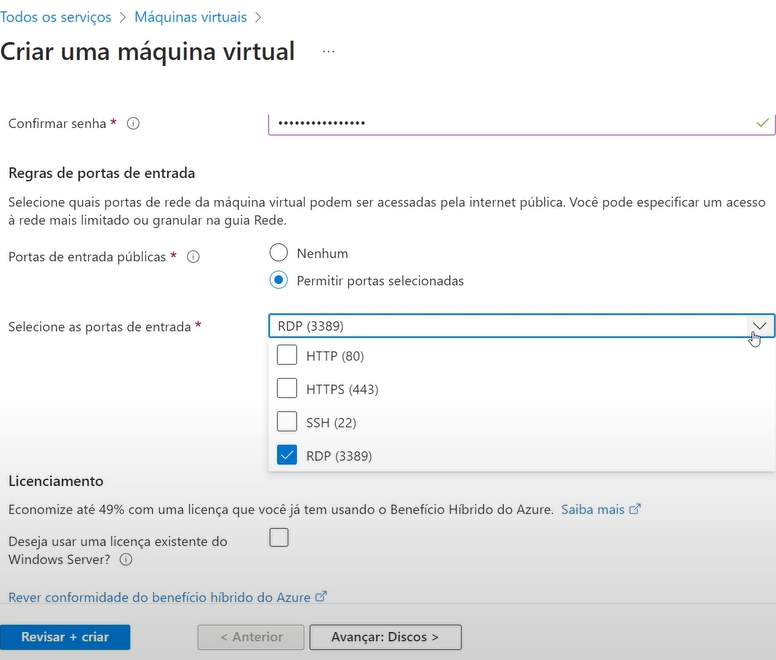 

- Manter sempre ativada a opção “Excluir com VM”, para exclusão de discos órfãos que têm custo mesmo sozinhos e sem estar associado a uma máquina, porque a exclusão só do nome do computador não retira todos os recurso da VM padrão. Discos podem ser incluídos e excluídos a qualquer momento na configuração da VM. Na aba de Rede, é necessário manter ativada a opção “Excluir IP púclico e a NIC quando a VM for excluída” para não ficar com placa de rede inútil e associada à assinatura do serviço.
    

  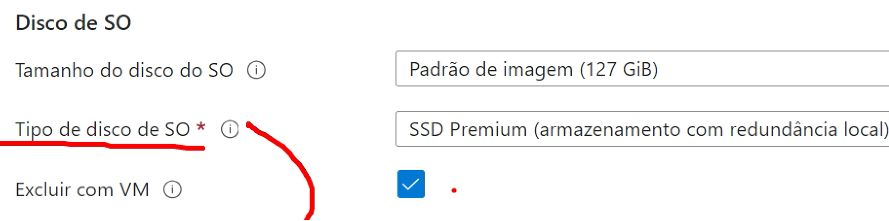
  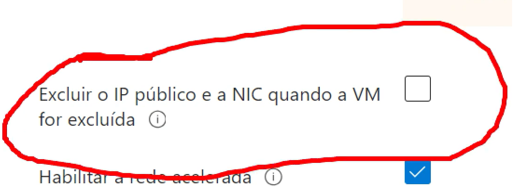

- Na aba Gerenciamento, é possível selecionar a opção de entrada com Azure AD na VM, além da configuração de usuário e senha; fazer desligamento automático (útil em caso de máquina usada para desenvolvimento/testes), avisado pelo e-mail cadastrado, porém não há ligamento automatizado. É preciso criar conta de serviço para fazer o Stop/Start manual da máquina; habilitar backup manualmente porque a VM é recurso de IaaS.
    

 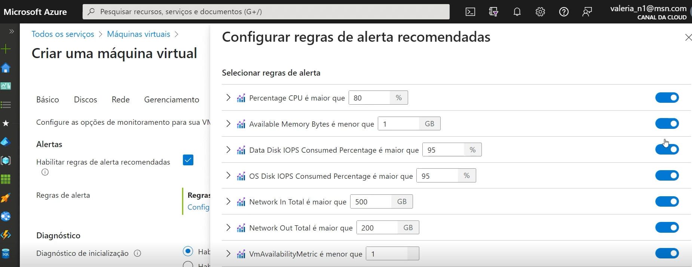  

- Na parte de Monitoramento, habilitam-se regras de alertas, por tipo de métrica; o campo de Diagnóstico pode ser desabilirtado para não gerar consumo. Na aba Avançado, pode ser selecionado algum tipo de extensão ou aplicativo de VM para ser instalado na VM quando ela estiver subindo. No final da configuração da VM, é disponibilizada a aba para revisão, com previsão de preço, e criação.
    

 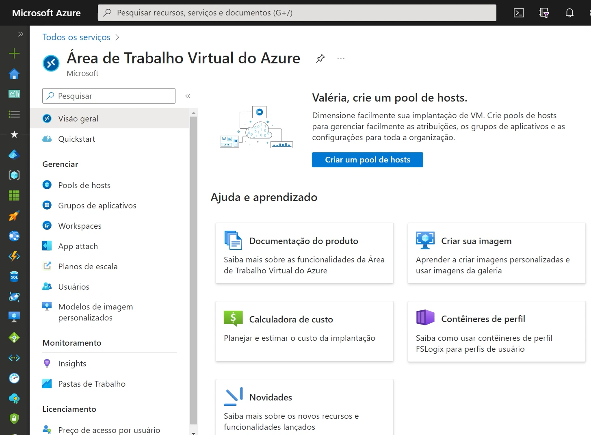  

- Existe também o recurso de Área de Trabalho Virtual do Azure, por ex., para suprir a necessidade de habilitar um funcionário remotamente, sem envio de um computador. É criada uma imagem com os itens de trabalho da empresa e a pessoa conecta com login e senha da conta 365, para usar também e-mail e Teams. A escolha do pool de host pessoal para a AT virtual é destinada a alguém que tem algo particula e específico no computador, como um software licenciado. É mais vantajoso configurar como pool que é dividido entre vários usuários simultâneos (usuários por host).
    

 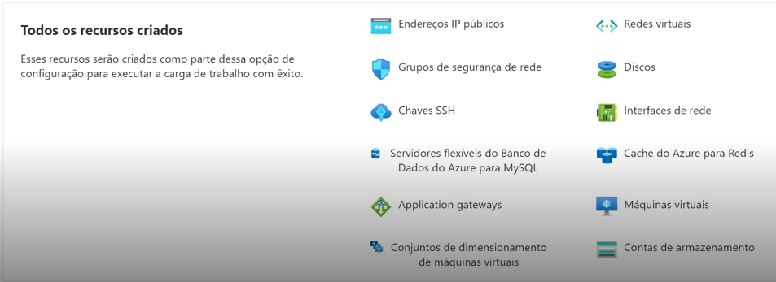  

- Na criação de Aplicativo de Funções, o escolher a Pilha de Runtime e a versão (linguagem de programação), é selecionado automaticamente o sistema operacional compatível. Por exemplo, se o app é feito com .NET, será com Windows, se for em Python é com Linux. É ncessário ter uma conta de armazenamento para criar esse recurso.
    

 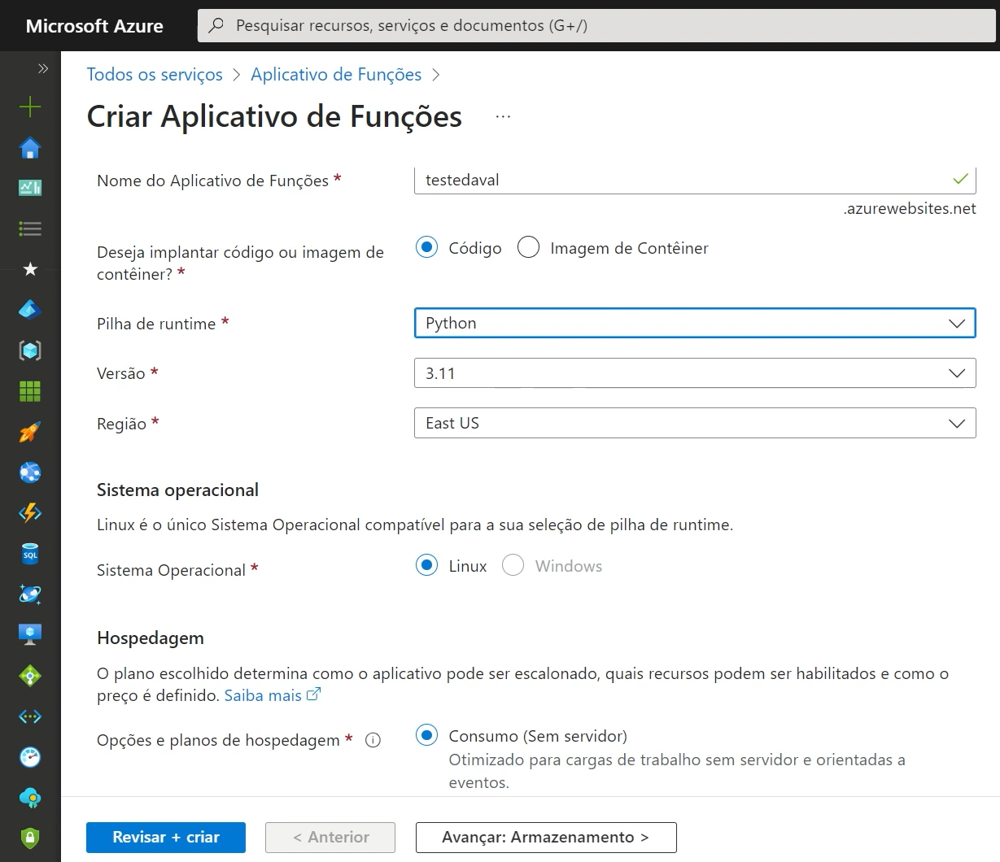  

  

---  

## ❔EXEMPLO DE PERGUNTA DO EXAME AZ900   

<b>Quando existe um grupo de pessoas trabalhando e há intenção de lhe oferecer um ambiente personalizado dentro do Azure, qual recurso pode ser criado?
  
RESPOSTA => Área de Trabalho Virtual do Azure.</b>    

---    
## ✍️ AUTORA    

Carla Edila Silveira  
Contato: rosa.carla@pucpr.edu.br  

---  
## ©️ LICENÇA

[MIT](https://choosealicense.com/licenses/mit/)  

---  
## 🔗 LINKS ÚTEIS  

- [Máquinas Virtuais do Azure](https://azure.microsoft.com/pt-br/products/virtual-machines)
- [Área de Trabalho Virtual do Azure](https://azure.microsoft.com/pt-br/products/virtual-desktop)
- [Tutorial: criar um aplicativo de funções que se conecta aos serviços do Azure usando identidades em vez de segredos](https://learn.microsoft.com/pt-br/azure/azure-functions/functions-identity-based-connections-tutorial)

---

